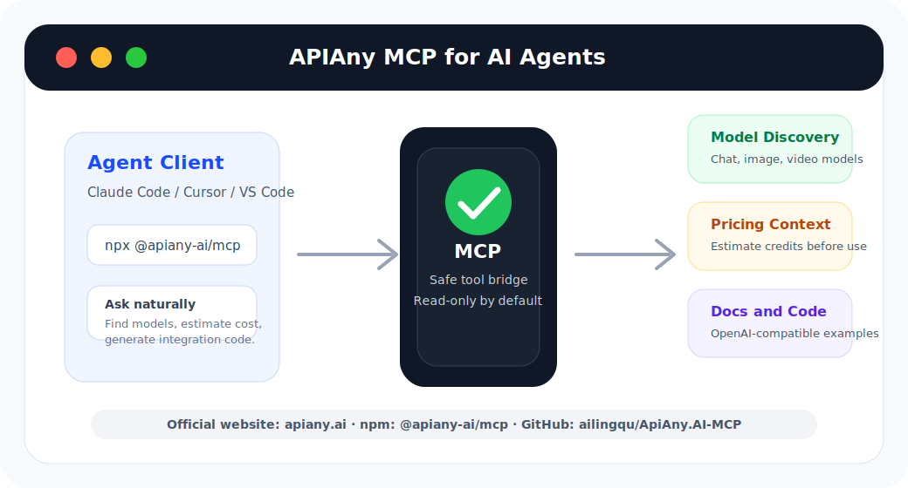
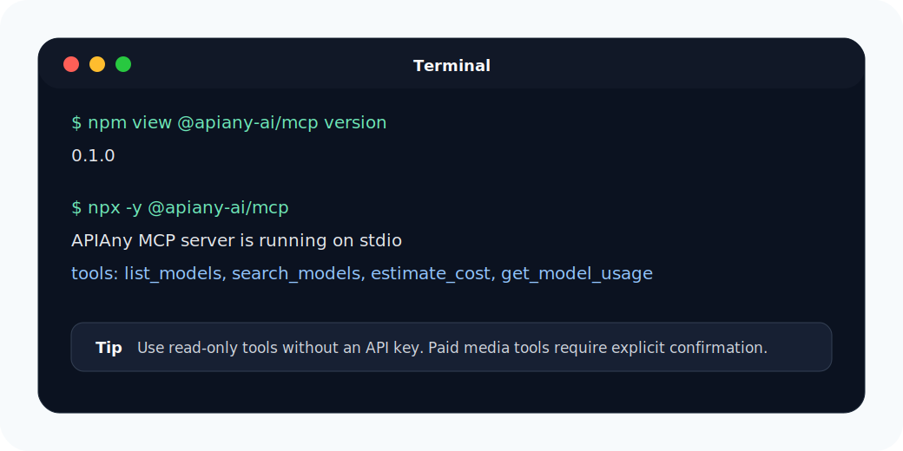
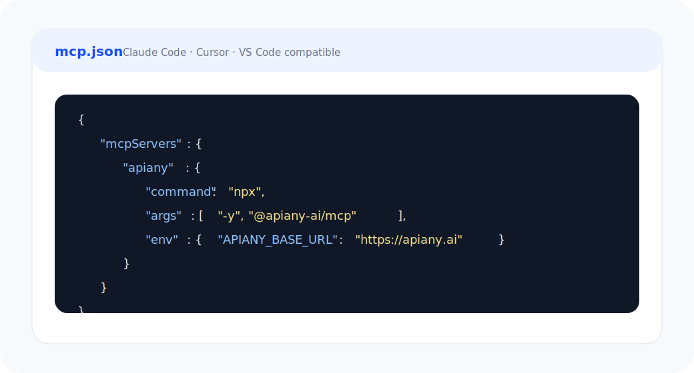
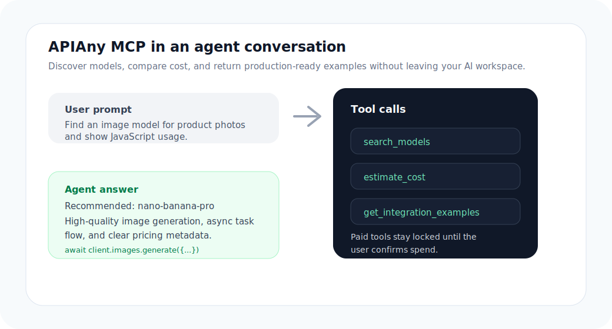

<h1 align="center">APIAny MCP</h1>

<p align="center">
  <strong>APIAny 官方 MCP 服务：为智能体提供模型发现、价格上下文、文档检索和 OpenAI 兼容调用示例。</strong>
</p>

<p align="center">
  <a href="https://apiany.ai">APIAny</a> 为开发者和智能体统一接入 100+ 个聊天、图像、视频和多模态 AI 模型。
</p>

<p align="center">
  <a href="https://www.npmjs.com/package/@apiany-ai/mcp"></a>
  <a href="https://www.npmjs.com/package/@apiany-ai/mcp"></a>
  <a href="https://github.com/ailingqu/ApiAny.AI-MCP/releases"></a>
  <a href="LICENSE"></a>
  
  
</p>

<p align="center">
  <a href="#快速开始">快速开始</a> ·
  <a href="#图文配置">图文配置</a> ·
  <a href="#mcp-工具">MCP 工具</a> ·
  <a href="#agent-skill">Agent Skill</a> ·
  <a href="#开发">开发</a>
</p>

<p align="center">
  <a href="README.md">English</a> | <strong>中文</strong>
</p>

<p align="center">
  
</p>

## 这个仓库提供什么

APIAny MCP 让 AI Agent 可以用结构化工具理解并使用 [APIAny](https://apiany.ai)：

- 按供应商、模型类型、能力和价格元数据发现 APIAny 公共模型。
- 在选择模型或执行工作流前估算 APIAny credits。
- 从 APIAny 文档和 `llms.txt` 获取紧凑文档上下文。
- 生成 OpenAI 兼容的 cURL、Python、JavaScript、Go、Java、PHP 调用示例。
- 仅在配置 API key 且用户明确确认付费请求时，创建图像或视频生成任务。
- 在 `skills/apiany-integration` 中提供 Agent Skill，让支持 skill 的智能体理解 APIAny 工作流。

## 快速开始

直接通过 npm 运行：

```bash
npx -y @apiany-ai/mcp
```

或者从源码运行：

```bash
git clone git@github.com:ailingqu/ApiAny.AI-MCP.git
cd ApiAny.AI-MCP
npm install
npm start
```

## 图文配置

### 1. 安装并启动 MCP 服务

<p align="center">
  
</p>

### 2. 在 Agent 客户端中加入 APIAny MCP

可用于 Claude Code、Cursor、VS Code 或其他兼容 MCP 的客户端：

<p align="center">
  
</p>

```json
{
  "mcpServers": {
    "apiany": {
      "command": "npx",
      "args": ["-y", "@apiany-ai/mcp"],
      "env": {
        "APIANY_BASE_URL": "https://apiany.ai"
      }
    }
  }
}
```

如果要使用付费图像或视频任务工具，还需要配置 `APIANY_API_KEY`：

```json
{
  "APIANY_BASE_URL": "https://apiany.ai",
  "APIANY_API_KEY": "your_apiany_api_key"
}
```

### 3. 让 Agent 使用 APIAny

<p align="center">
  
</p>

示例提示词：

```text
使用 APIAny MCP 找一个适合商品图的图像模型，对比价格，并给我 JavaScript 调用示例。
```

```text
使用 APIAny MCP 估算 20 次聊天请求的 credits，输入 10k tokens，输出 5k tokens。
```

```text
使用 APIAny MCP 展示 nano-banana-pro 的 JavaScript 用法，以及 veo3-1-fast 的 Python 用法。
```

## MCP 工具

| 工具 | 用途 | 是否需要 API key |
| --- | --- | --- |
| `list_models` | 列出公共 APIAny 模型、价格和能力元数据。 | 否 |
| `search_models` | 按文本、供应商、类型或能力搜索模型。 | 否 |
| `get_model` | 按模型 ID 或显示名称获取单个模型。 | 否 |
| `estimate_cost` | 根据公共价格元数据估算 credits。 | 否 |
| `get_model_usage` | 返回模型 endpoint、payload、异步行为和语言示例。 | 否 |
| `get_integration_examples` | 返回 cURL、Python、JavaScript、Go、Java、PHP 示例。 | 否 |
| `get_docs_context` | 从 `/llms.txt` 返回紧凑 APIAny 文档上下文。 | 否 |
| `create_image_task` | 在明确确认后创建付费异步图像任务。 | 是 |
| `create_video_task` | 在明确确认后创建付费异步视频任务。 | 是 |
| `get_task_status` | 查询异步媒体任务状态。 | 是 |

## Agent Skill

APIAny Integration skill 位于 [`skills/apiany-integration`](skills/apiany-integration)。

它可以帮助智能体：

- 按类型、供应商、价格和能力选择 APIAny 模型。
- 生成聊天、图像、视频和媒体工作流示例。
- 解释异步任务创建和轮询流程。
- 在付费生成任务前要求用户明确确认。

## 环境变量

| 变量 | 是否必需 | 说明 |
| --- | --- | --- |
| `APIANY_BASE_URL` | 否 | APIAny 基础 URL，默认 `https://apiany.ai`。 |
| `APIANY_API_KEY` | 仅付费工具需要 | 用于创建付费图像/视频任务和查询任务状态。 |

## 安全边界

只读工具不需要 API key。付费生成工具必须同时满足：

- 配置 `APIANY_API_KEY`
- 请求参数包含 `confirm_paid_request=true`

服务不会持久化 API key，只会从当前进程环境变量读取。

## 开发

```bash
npm install
npm run check
npx -y @modelcontextprotocol/inspector node src/server.js
```

常用文件：

- [`src/server.js`](src/server.js)：MCP 服务实现。
- [`examples/mcp.json`](examples/mcp.json)：客户端配置示例。
- [`docs/distribution.md`](docs/distribution.md)：npm、MCP 目录和 skill 市场发布清单。
- [`CHANGELOG.md`](CHANGELOG.md)：发布记录。

## 链接

- 官网：[https://apiany.ai](https://apiany.ai)
- GitHub：[https://github.com/ailingqu/ApiAny.AI-MCP](https://github.com/ailingqu/ApiAny.AI-MCP)
- npm：[https://www.npmjs.com/package/@apiany-ai/mcp](https://www.npmjs.com/package/@apiany-ai/mcp)
- Models：[https://apiany.ai/models](https://apiany.ai/models)
- Docs context：[https://apiany.ai/llms.txt](https://apiany.ai/llms.txt)

## License

MIT
